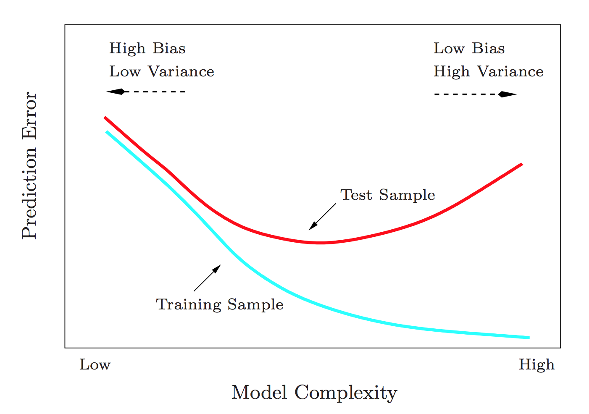

<script src='https://cdnjs.cloudflare.com/ajax/libs/mathjax/2.7.2/MathJax.js?config=TeX-MML-AM_CHTML'></script>

```{r setup, include=FALSE}
options(htmltools.dir.version = FALSE)
knitr::opts_chunk$set(cache=TRUE)
```

## Motivation

.state[more accurate predictions]

```{r test_train, echo = FALSE, out.width=500, fig.align = "center"}

```

Image credit: [Elements of Statistical Learning](https://web.stanford.edu/~hastie/Papers/ESLII.pdf)

---
## Motivation

.state[sift through many candidate predictors]

enable inference when $p \gg n$, e.g:
 - Feature engineering
 - Genome Wide Association Studies (GWAS)
 
```{r gwas, echo = FALSE, out.width=800, fig.align = "center"}
knitr::include_graphics("Manhattan_Plot.png")
```
 
Image credit: [Wikimedia Commons](https://commons.wikimedia.org/wiki/File:Manhattan_Plot.png)
---
## The idea

<br>

.medium[we want a model that fits the data, but we also don't want coefficients to be too big]

<br>

.medium[we don't care about obtaining an unbiased estimator of the coefficients]

<br>

.state[*shrink* coefficients toward zero by adding a penalty on their size]

---
## The idea

.medium[linear regression:]

$$\hat{\beta} = \underset{\beta}{\mathrm{argmin}} \{ \mathrm{RSS}(\beta)\}$$

$$\mathrm{RSS}(\beta) = \sum_{i=1}^N(y_i - \hat{y}_i)^2$$
$$\mathbf{\hat{\mathbf{y}}} = \alpha + \mathbf{X}\beta$$

<br>

.medium[penalized regression:]
$$\hat{\beta}^\mathrm{penalized} = \underset{\beta}{\mathrm{argmin}} \{ \mathrm{RSS}(\beta) + f(\beta)\}$$

---

## Two penalties:
  

<br>

<br>

.state[Ridge regression]

Hoerl & Kennard (1970) -  [link](https://doi.org/10.2307%2F1267351)

<br>

.state[The lasso]

Tibshirani (1996) - [link](https://www.jstor.org/stable/2346178)

---
## Ridge regression

<br>

.medium[penalise *sum of beta squared*] (the L<sup>2</sup>-norm)

<br>

$$f(\beta) = \lambda \sum_{i=1}^p\beta^2$$
<br>
$$\hat{\beta}^\mathrm{ridge} = \underset{\beta}{\mathrm{argmin}} \{ \mathrm{RSS}(\beta) + \lambda \sum_{i=1}^p\beta^2\}$$

---
background-image: url("ridge_demo.png")
background-position: center
background-repeat: no-repeat
background-size: 90%

## Ridge regression demo

<br><br><br><br><br><br><br><br><br><br><br><br><br><br><br><br><br><br>

[goldingn.shinyapps.io/shrinkage_demo](https://goldingn.shinyapps.io/shrinkage_demo)
---
## Ridge regression

.medium[as constrained optimisation]

  
$$\hat{\beta}^\mathrm{ridge} = \underset{\beta}{\mathrm{argmin}} \{ \mathrm{RSS}(\beta)\} \,\,\,\,\,\,\,\, \mathrm{s.t.}\,\, \sum_{i=1}^p\beta^2 < t$$
<br>
<!--
if parameters within constrained region, no shrinkage.
otherwise they are brought to the constraint
-->

```{r ridge_constraint, echo = FALSE, fig.width = 15, fig.height = 5.5, dpi = 600, dev.args = list(pointsize = 25)}
source("constraint_app/functions.R")
data <- simulate_data()
fit <- fit_ls(data)
density <- density_surface(fit)

par(mfrow = c(1, 3))

# coefficients not shrunk
plot_setup()
add_density(density)

lambda <- 0.1
ridge <- plotting_data(lambda, type = "ridge")

add_contour(ridge$RSS)

c <- find_c(ridge$beta)
pts <- constraint_points(c, "ridge")
add_constraint(pts)
points(ridge$beta[1], ridge$beta[2], pch = 16)

title(bquote(lambda == .(lambda) ~~~~ t == .(round(c ^ 2, 2))))

# coefficients not shrunk
plot_setup()
add_density(density)
ridge <- plotting_data(0, type = "ridge")
c <- find_c(ridge$beta)
pts <- constraint_points(c, "ridge")
add_constraint(pts)

title(bquote(lambda == 0 ~~~~ t == sum(beta^2)))

# coefficients completely shrunk
plot_setup()
add_density(density)
c <- 0.05
pts <- constraint_points(c, "ridge")
add_constraint(pts)

title(bquote(lambda == infinity ~~~~ t == 0  ))
```

---
## The lasso

.medium[penalise *sum of modulus of beta*] (the L<sup>1</sup>-norm)

$$f(\beta) = \lambda \sum_{i=1}^p|\beta|$$

so

$$\hat{\beta}^\mathrm{lasso} = \underset{\beta}{\mathrm{argmin}} \{ \mathrm{RSS}(\beta) + \lambda \sum_{i=1}^p|\beta|\}$$

or equivalently

$$\hat{\beta}^\mathrm{lasso} = \underset{\beta}{\mathrm{argmin}} \{ \mathrm{RSS}(\beta)\} \,\,\,\,\,\,\,\, \mathrm{s.t.}\,\, \sum_{i=1}^p|\beta| < t$$

---
## ridge vs. lasso

```{r constraint_comparison, echo = FALSE, out.height = 500, out.width = 500, fig.align="center", dpi = 600}

source("constraint_app/functions.R")

par(mfrow = c(2, 2),
    mar = c(4, 4, 3, 2))


# set up the plotting data
n <- 151
beta_seq <- seq(-5, 5, length.out = n)
betas <- expand.grid(beta_1 = beta_seq,
                     beta_2 = beta_seq)

ridge_penalty <- function (x) sum(x ^ 2)
lasso_penalty <- function (x) sum(abs(x))

ridge <- apply(betas, 1, ridge_penalty)
lasso <- apply(betas, 1, lasso_penalty)

ridge_mat <- matrix(ridge, nrow = n)
lasso_mat <- matrix(lasso, nrow = n)
  
levels <- seq(0, 30, by = 2)
pal <- colorRampPalette(c(grey(0.5), grey(0.99)))
cols <- rev(pal(length(levels)))

plot_setup()
title(bquote("ridge penalty" ~ (L^2-norm)))
.filled.contour(beta_seq, beta_seq, ridge_mat,
                levels = levels,
                col = cols)
contour(beta_seq, beta_seq, ridge_mat,
        levels = levels,
        col = grey(0.8),
        drawlabels = FALSE,
        add = TRUE)
abline(v = 0, h = 0, col = grey(0.6))

levels <- seq(0, 15, by = 0.5)
cols <- rev(pal(length(levels)))

plot_setup()
title(bquote("lasso penalty" ~ (L^1-norm)))
.filled.contour(beta_seq, beta_seq, lasso_mat,
                levels = levels,
                col = cols)
contour(beta_seq, beta_seq, lasso_mat,
        levels = levels,
        col = grey(0.8),
        drawlabels = FALSE,
        add = TRUE)
abline(v = 0, h = 0, col = grey(0.6))

plot_setup()
title(bquote("ridge constraint" ~ ""))
pts <- constraint_points(2, "ridge")
add_constraint(pts)

plot_setup()
title(bquote("lasso constraint" ~ ""))
pts <- constraint_points(2, "lasso")
add_constraint(pts)

```


---
background-image: url("lasso_demo.png")
background-position: center
background-repeat: no-repeat
background-size: 90%

## Lasso shrinks coefficients to zero!

<br><br><br><br><br><br><br><br><br><br><br><br><br><br><br><br><br><br>

[goldingn.shinyapps.io/shrinkage_demo](https://goldingn.shinyapps.io/shrinkage_demo)
---
background-image: url("constraint_app.png")
background-position: center
background-repeat: no-repeat
background-size: 70%

## Why does lasso shrink to zero?

<br><br><br><br><br><br><br><br><br><br><br><br><br><br><br><br><br><br>

[goldingn.shinyapps.io/constraint_app](https://goldingn.shinyapps.io/constraint_app/)
---
## Estimation

<br>

.medium[linear regression:]
$$\hat{\beta} = (\mathbf{X}'\mathbf{X})^{-1} \mathbf{X}'\mathbf{y}$$

<br>

.medium[ridge regression:]
$$\hat{\beta}^{\mathrm{ridge}} = (\mathbf{X}'\mathbf{X} + \lambda \mathbf{I})^{-1} \mathbf{X}'\mathbf{y}$$

<br>

.medium[lasso has no closed-form solution, so we optimize numerically]

---
## practical issues

<br>

.medium[ridge and lasso estimates are influenced by scale of covariates, so we usually standardize covariates first]

<br>

.medium[select lambda by cross-validation]

```{r shrinkage profile, eval = FALSE}
library (glmnet)

# lasso
cv.glmnet(x, y, alpha = 0, nfolds = 5)

# ridge
cv.glmnet(x, y, alpha = 1, nfolds = 5)
```

---
## Bayesian equivalence

$$p(\beta|\mathbf{X}, y) \propto p(y | \mathbf{X} \beta) p(\beta)$$

<!--$$\hat{\beta} = \underset{\beta}{argmin} \{ RSS(\beta) \} = \underset{\beta}{argmax} \{ p(y|\mathbf{X}\beta) \}$$-->

$$\hat{\beta}_{MAP}(\mathbf{X}, y) = \underset{\beta}{argmin}  \{ RSS(\beta) + -ln\, p(\beta) \}$$


<!--$$-ln\, N(\beta; 0, \lambda^{-1}) = \lambda \sum_i^p\beta_i^2 + \mathrm{const.}$$-->

<!--$$-ln\, \mathrm{Laplace}(\beta; 0, \sigma^2) = \sum_i^p|\beta_i| + \mathrm{const.}$$-->

<br>

```{r priors, fig.height = 4.5, fig.width = 10, dpi = 600, echo = FALSE}
setup <- function (ylim) {
  plot.new()
  plot.window(xlim = c(-3, 3),
              ylim = ylim)
  axis(1, lty = 0, col.axis = grey(0.6), cex = 0.8)
  axis(2, lty = 0, las = 1, col.axis = grey(0.6), cex = 0.8)
  rect(-10, -10, 10, 10,
       border = NA,
       col = grey(0.95))
  abline(v = 0, h = 0, col = grey(0.6))
}
x <- seq(-3, 3, length.out = 1000)
d_normal <- dnorm(x, 0, 1, log = TRUE)
d_laplace <- log(1 / (2 * 1)) + (-abs(x - 0) / 1)

par(mfrow = c(1, 2),
    mar = c(5, 7, 4, 0))

setup(range(d_normal))
lines(d_normal ~ x, lwd = 2)
title(bquote(beta[i] %~% italic(N)(0, 1)),
      cex.main = 1.5)
title(xlab = bquote(beta[i]),
      cex.lab = 1.5)
mtext(bquote(italic(ln) ~ p(beta[i])),
      side = 2, las = 1, line = 3,
      cex = 1.5)

setup(range(d_laplace))
lines(d_laplace ~ x, lwd = 2)
title(bquote(beta[i] %~% italic(Laplace)(0, 1)),
      cex.main = 1.5)
title(xlab = bquote(beta[i]),
      cex.lab = 1.5)

```
<!-- equivalences in machine learning (weight decay & basis pursuit); AKA Tikhonov regularisation -->
---
## Other shrinkage methods

<br>

.large[Least Angle Regression]

closely related to lasso

<br>

.large[Elastic net]

a mixture of ridge and lasso penalties

$f(\beta) = \lambda \sum_{i=1}^p a \beta_i^2 + (1 - a)|\beta_i|$


---
## materials

<br>

`r icon::fa("github", 5)`

.large[[slides, code, interactives](https://github.com/goldingn/shrinkage_lecture)]

`github.com/goldingn/shrinkage_lecture`

<br>

.large[[glmnet R package](https://cran.r-project.org/web/packages/glmnet/index.html)]

including introductory vignette


